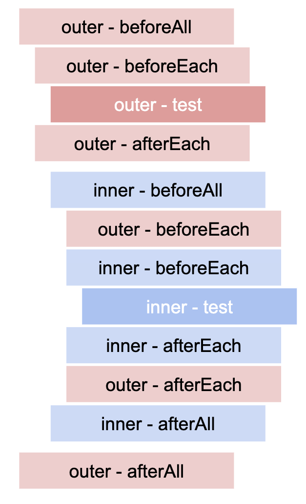

# JEST
- 목표
    - Jest에 대해 조사하고 개인 리포에 정리하고 공유한다.
    - Jest 환경을 구성한다.
    - 제공되는 API 예제코드를 작성해보고 정리한다.

* * * 

## 테스트의 의미와 종류
- Jest 정리에 앞서 테스트의 의미와 종류에 대해 찾아보았다.

### 테스트란?
> 테스트를 소프트웨어의 관점에서 정의하자면 *"애플리케이션이 요규 사항에 맞게 동작하는지를 검증하는 행위"* 라고 할 수 있다.
> 보통 개발과는 별도의 전문 영역으로 분류되며, 일정 규모 이상의 회사에서는 QA 조직에 속한 전문 테스터들이 이 역할을 수행하는 것이 일반적이다.

> 근래에는 *테스트 주도 개발(TDD)* 등이 대중화 되면서, 테스트는 점점 더 개발 단계의 일부로 받아들여지고 있다. 
>
> 여기서 말하는 테스트란 주로 코드로 작성된 자동화 테스트를 말한다.
> 
> 개발자가 테스트 코드를 직접 작성하게 되면 더 적극적으로 리팩토링 등의 코드 개선을 할 수 있어 코드 품질이 향상되며, 개발 단계에서의 제품 품질이 향상되어 테스터와의 불필요한 커뮤니케이션 비용이 감소하게 된다.

### 단위 테스트

> 단위 테스트는 작은 단위(주로 모듈 단위)를 전체 애플리케이션에서 떼어 내어 분리된 환경에서 테스트하는 것을 말한다.
>
> 분리된 상태의 테스트이기 때문에 하나의 모듈이나 클래스에 대해 세밀한 부분까지 테스트할 수 있고 더 넓은 범위에서 테스트할 때보다 훨씬 빠르게 실행할 수 있다. 
>
> 하지만 단위 테스트는 의존성이 있는 모듈을 제어하기 위해 필연적으로 모의 객체(Mocking)을 사용할 수밖에 없으며, 이 경우 각 모듈이 실제로 잘 연결되어 상호 작용하는지에 대해서는 검증하지 못한다.
>
> 또한 각 모듈의 사소한 API 변경에도 영향을 받기 때문에 작은 단위의 리팩토링에도 쉽게 깨지는 문제가 있다.

### 통합 테스트

> 통합 테스트는 단위 테스트보다 좀 더 넓은 범위의 테스트를 말하며 보통 두 개 이상의 모듈이 실제로 연결된 상태를 테스트한다.
>
> 여러 개의 모듈이 동시에 상호 작용하는 것을 테스트하기 때문에 단위 테스트에 비해 모의 객체의 사용이 적으며, 모듈 간의 연결에서 발생하는 에러를 검증할 수 있다.
>
> 또한 비교적 넓은 범위에서의 API 변경에만 영향을 받기 때문에 단위 테스트와 비교해 리팩토링을 할 때 쉽게 깨지지 않는 장점이 있다.
>
> 하지만 단일 모듈이 복잡한 알고리즘이나 분기문을 갖고 있을 때 단위 테스트에 비해 테스트가 번거롭고, 테스트 중복이 발생할 확률이 높다는 단점이 있다.

### E2E 테스트

> E2E 테스트는 이와 다르게 실제 사용자의 관점에서 테스트를 진행하며, 그런 의미에서 기능(Functional) 테스트 혹은 UI(User Interface) 테스트라고 불리기도 한다.
>
> E2E 테스트는 사용자의 실행 환경과 거의 동일한 환경에서 테스트를 진행하기 때문에 실제 상황에서 발생할 수 있는 에러를 사전에 발견할 수 있다는 장점이 있다.
>
> 특히 브라우저를 외부에서 직접 제어할 수 있어 자바스크립트의 API만으로는 제어할 수 없는 행위(브라우저 크기 변경, 실제 키보드 입력 등)를 테스트할 수도 있다.
>
> 또한 테스트 코드가 실제 코드 내부 구조에 영향을 받지 않기 때문에 큰 범위의 리팩토링에도 깨지지 않으며, 이를 통해 개발자들이 좀 더 자신감 있게 코드를 개선할 수 있도록 도와준다.
>
> 반면 단위 테스트나 통합 테스트에 비해 테스트의 실행 속도가 느리기 때문에 개발 단계에서 빠른 피드백을 받기가 어려우며, 세부 모듈들이 갖는 다양한 상황들의 조합을 고려해야 하기 때문에 테스트를 작성하기가 쉽지 않다는 단점이 있다.
>
> 또한 큰 단위의 기능을 작은 기능으로 나누어 테스트할 수가 없기 때문에 필연적으로 테스트 사이에 중복이 발생할 수밖에 없다.
>
> 게다가 통제된 샌드박스 환경에서의 테스트가 아니기 때문에 테스트 실행 환경의 예상하지 못한 문제들(네트워크 오류, 프로세스 대기로 인한 타임아웃 등)로 인해 테스트가 가끔 실패하는 일이 발생하며, 이 때문에 테스트를 100% 신뢰할 수 없는 문제가 발생하기도 한다.

* * * 

## Jest
- 페이스북에서 만든 오픈소스 테스트 프레임워크이며, 최근 프론트엔드 개발에서 가장 활발하게 사용되는 테스트 도구이다.
- Node.js 환경에서 코드를 실행하는 테스트 러너이다.
    > ### 테스트 러너
    > - 테스트 파일을 읽어 들여 작성한 코드를 실행하고, 그 결과를 특정한 형식으로 출력해준다.
    > - 테스트 수행 결과는 리포터를 지정해서 원하는 형태로 출력할 수 있다.
    > - 부가적으로 테스트 코드나 소스 코드가 변경된 경우 영향을 받는 테스트를 자동으로 재실행해주는 왓쳐(Watcher) 등의 기능도 제공한다.

### Getting Started
- [Getting Started](https://jestjs.io/docs/en/getting-started)
```bash
npm i jest -D
```

- using babel
  ```bash
  npm i babel-jest @babel/core @babel/preset-env -D
  ```

### Using Matchers
- [Using Matchers](https://jestjs.io/docs/en/using-matchers)

### Common Matchers
#### toBe
- 정확한 값 일치 여부 확인
- Object.is 로 구성되어 있으므로 Object 의 값을 체크하기 위해서는 toEqual 을 사용해야 한다.
```javascript
test('two plus two is four', () => {
  expect(2 + 2).toBe(4);
});
```

#### toEqual
- Object 또는 Array의 모든 필드 값을 재귀적으로 체크
```javascript
test('object assignment', () => {
  const data = {one: 1};
  data['two'] = 2;
  expect(data).toEqual({one: 1, two: 2});
});
```

#### not
- 불일치 여부 확인

```javascript
test('adding positive numbers is not zero', () => {
  for (let a = 1; a < 10; a++) {
    for (let b = 1; b < 10; b++) {
      expect(a + b).not.toBe(0);
    }
  }
});

test('object assignment is not toEqual', () => {
  const data = {one: 1};
  data['two'] = 2;
  expect(data).not.toEqual({one: 1, two: 3});
});
```

### Truthiness
- null, undefined, truthy, falsy 를 활용할 때
- `toBeNull` : null 여부 만 확인
- `toBeUndefined` : undefined 여부 만 확인
- `toBeDefined` : toBeUndefined의 반대 경우 확인
- `toBeTruthy` : true로 취급되는 구문을 확인
- `toBeFalsy` : false로 취급되는 구문을 확인

```javascript
test('null', () => {
  const n = null;
  expect(n).toBeNull(); 
  expect(n).toBeDefined();
  expect(n).not.toBeUndefined();
  expect(n).not.toBeTruthy();
  expect(n).toBeFalsy();
});

test('zero', () => {
  const z = 0;
  expect(z).not.toBeNull();
  expect(z).toBeDefined();
  expect(z).not.toBeUndefined();
  expect(z).not.toBeTruthy();
  expect(z).toBeFalsy();
});
```

### Numbers
- `toBeGreaterThan` : 큰 숫자 여부 확인
- `toBeGreaterThanOrEqual` : 같거나 큰 숫자 여부 확인
- `toBeLessThan` : 작은 숫자 여부 확인
- `toBeLessThanOrEqual` : 같거나 작은 숫자 여부 확인

```javascript
test('two plus two', () => {
  const value = 2 + 2;
  expect(value).toBeGreaterThan(3);
  expect(value).toBeGreaterThanOrEqual(3.5);
  expect(value).toBeLessThan(5);
  expect(value).toBeLessThanOrEqual(4.5);

  // toBe and toEqual are equivalent for numbers
  expect(value).toBe(4);
  expect(value).toEqual(4);
});
```

- `toBeCloseTo` : 값이 근접해 있는지 체크

```javascript
test('adding floating point numbers', () => {
  const value = 0.1 + 0.2;
  //expect(value).toBe(0.3);           This won't work because of rounding error
  expect(value).toBeCloseTo(0.3); // This works.
});
```

### Strings
- `toMatch` : 정규식을 이용해서 문자열의 일치 여부 확인

```javascript
test('there is no I in team', () => {
  expect('team').not.toMatch(/I/);
});

test('but there is a "stop" in Christoph', () => {
  expect('Christoph').toMatch(/stop/);
});
```

### Arrays and iterables
- `toContain` : Array 또는 iteration이 가능한 (Set, Map 등...) 객체에 특정 요소 포함 여부를 확인

```javascript
const shoppingList = [
  'diapers',
  'kleenex',
  'trash bags',
  'paper towels',
  'beer',
];

test('the shopping list has beer on it', () => {
  expect(shoppingList).toContain('beer');
  expect(new Set(shoppingList)).toContain('beer');
});
```

### Exceptions
- `toThrow`
  - 함수 호출 시 에러 발생 여부 확인
  - 단순 에러 및 특정 에러 지정 가능

```javascript
function compileAndroidCode() {
  throw new Error('you are using the wrong JDK');
}

test('compiling android goes as expected', () => {
  expect(() => compileAndroidCode()).toThrow();
  expect(() => compileAndroidCode()).toThrow(Error);

  // You can also use the exact error message or a regexp
  expect(() => compileAndroidCode()).toThrow('you are using the wrong JDK');
  expect(() => compileAndroidCode()).toThrow(/JDK/);
});
```

* * *

### Testing Asynchronous Code
- 비동기 코드 테스트

#### Callbacks

- Bad Case
  - callback 함수가 호출되지 않고 test 종료
  - 잘못 된 결과가 나와도 테스트가 통과 됨

```javascript
const fetchData = (cb) => {
  setTimeout(() => {
    console.log("wait 3.5 sec.");
    cb('peanut butter');
  }, 3500);
};

// Bad Case
test('the data is peanut butter', () => {
  function callback(data) {
    expect(data).toBe('peanut butter1');
  }

  fetchData(callback);
});
```

- Good Case
  - test 함수의 인자로 done을 받아서 사용
  - done이 호출되어야 테스트 종료
  - 테스트가 실패하는 경우를 대비해서 try, catch로 예외 처리

```javascript
const fetchData = (cb) => {
  setTimeout(() => {
    console.log("wait 3.5 sec.");
    cb('peanut butter');
  }, 3500);
};

// Good Case
test('the data is peanut butter', done => {
  function callback(data) {
    try {
      expect(data).toBe('peanut butter');
      done();
    } catch (error) {
      done(error);
    }
  }

  fetchData(callback);
});
```

#### Promises
- test 코드에서 promise를 return
- return 안하면 callback을 이용한 방법에서 done을 빠뜨린 것과 같음
- promise의 resolve가 호출 될 때 까지 기다림
- promise의 reject가 호출 될 경우 테스트 실패
- promise 코드 안의 assertion 코드가 실제로 호출 됐는지는 expect.assertions 함수로 확인 가능
- then/catch를 이용하는 방법과 resolves/rejects를 이용하는 방법이 존재

```javascript
const fetchData = () => {
  return new Promise(resolve => {
    return setTimeout(() => {
      console.log("wait 3.5 sec.");
      resolve('peanut butter');
    }, 3500);
  });
}

const fetchDataError = () => {
  return new Promise((resolve, reject) => {
    return setTimeout(() => {
      console.log("wait 3.5 sec.");
      reject(new Error('error reason'));
    }, 3500);
  });
}

test('the data is peanut butter', () => {
  return fetchData().then(data => {
    expect(data).toBe('peanut butter');
  });
});

test('the fetch fails with an error', () => {
  expect.assertions(1);
  return fetchDataError().catch(e => expect(e.message).toMatch('error'));
});
```

##### resolve / reject

```javascript
const fetchData = () => {
  return new Promise(resolve => {
    return setTimeout(() => {
      console.log("wait 3.5 sec.");
      resolve('peanut butter');
    }, 3500);
  });
}

const fetchDataError = () => {
  return new Promise((resolve, reject) => {
    return setTimeout(() => {
      console.log("wait 3.5 sec.");
      reject(new Error('error reason'));
    }, 3500);
  });
}

test('the data is peanut butter', () => {
  return expect(fetchData()).resolves.toBe('peanut butter');
});

test('the fetch fails with an error', () => {
  // return expect(fetchDataError()).rejects.toMatch('error');
  return expect(fetchDataError()).rejects.toThrow('error');
});
```

#### Async/Await
- test에 넘기는 함수 앞에 async 키워드 추가
- promise를 반환하는 함수 호출 앞에 await 키워드 추가
- resolves/rejects 와 혼합해서 사용 가능

```javascript
const fetchData = () => {
  return new Promise(resolve => {
    return setTimeout(() => {
      console.log("wait 3.5 sec.");
      resolve('peanut butter');
    }, 3500);
  });
}

const fetchDataError = () => {
  return new Promise((resolve, reject) => {
    return setTimeout(() => {
      console.log("wait 3.5 sec.");
      reject(new Error('error'));
    }, 3500);
  });
}

test('the data is peanut butter', async () => {
  const data = await fetchData();
  expect(data).toBe('peanut butter');
});

test('the fetch fails with an error', async () => {
  try {
    await fetchDataError();
  } catch (e) {
    expect(e.message).toMatch('error');
  }
});

test('the data is peanut butter', async () => {
  await expect(fetchData()).resolves.toBe('peanut butter');
});

test('the fetch fails with an error', async () => {
  await expect(fetchDataError()).rejects.toThrow('error');
});
```

* * *

### Setup and Teardown
- 테스트 전 또는 후에 실행되어야 할 작업들을 다룰 수 있는 함수 제공

#### Repeating Setup For Many Tests
- `beforeEach / afterEach` : 테스트 마다 반복 실행이 필요한 작업

```javascript
const initializeCityDatabase = () => {
  console.log('initializeCityDatabase');
}

const clearCityDatabase = () => {
  console.log('clearCityDatabase');
}

const isCity = () => true;

beforeEach(() => {
  initializeCityDatabase();
});

afterEach(() => {
  clearCityDatabase();
});

test('city database has Vienna', () => {
  expect(isCity('Vienna')).toBeTruthy();
});

test('city database has San Juan', () => {
  expect(isCity('San Juan')).toBeTruthy();
});
```

#### One-Time Setup
- `beforeAll/afterAll` : 동일 레벨 또는 하위 레벨의 테스트가 실행 될 때 딱 한번만 실행

```javascript
const initializeCityDatabase = () => {
  console.log('initializeCityDatabase');
}

const clearCityDatabase = () => {
  console.log('clearCityDatabase');
}

const isCity = () => true;

beforeAll(() => {
  return initializeCityDatabase();
});

afterAll(() => {
  return clearCityDatabase();
});

test('city database has Vienna', () => {
  expect(isCity('Vienna')).toBeTruthy();
});

test('city database has San Juan', () => {
  expect(isCity('San Juan')).toBeTruthy();
});
```

#### Scoping
- 범위 지정

```javascript
const initializeFoodDatabase = () => {};
const isCity = () => true;
const isValidCityFoodPair = () => true;

// Applies to all tests in this file
beforeEach(() => {
  return initializeCityDatabase();
});

test('city database has Vienna', () => {
  expect(isCity('Vienna')).toBeTruthy();
});

test('city database has San Juan', () => {
  expect(isCity('San Juan')).toBeTruthy();
});

describe('matching cities to foods', () => {
  // Applies only to tests in this describe block
  beforeEach(() => {
    return initializeFoodDatabase();
  });

  test('Vienna <3 sausage', () => {
    expect(isValidCityFoodPair('Vienna', 'Wiener Schnitzel')).toBe(true);
  });

  test('San Juan <3 plantains', () => {
    expect(isValidCityFoodPair('San Juan', 'Mofongo')).toBe(true);
  });
});
```

```javascript
beforeAll(() => console.log('1 - beforeAll'));
afterAll(() => console.log('1 - afterAll'));
beforeEach(() => console.log('1 - beforeEach'));
afterEach(() => console.log('1 - afterEach'));
test('', () => console.log('1 - test'));
describe('Scoped / Nested block', () => {
  beforeAll(() => console.log('2 - beforeAll'));
  afterAll(() => console.log('2 - afterAll'));
  beforeEach(() => console.log('2 - beforeEach'));
  afterEach(() => console.log('2 - afterEach'));
  test('', () => console.log('2 - test'));
});

// 1 - beforeAll
// 1 - beforeEach
// 1 - test
// 1 - afterEach
// 2 - beforeAll
// 1 - beforeEach
// 2 - beforeEach
// 2 - test
// 2 - afterEach
// 1 - afterEach
// 2 - afterAll
// 1 - afterAll
```



#### Order of execution of describe and test blocks
- 실제 test 코드는 나머지 코드들이 먼저 실행되고 난 후 제일 마지막에 순서대로 실행 됨

```javascript
describe('outer', () => {
  console.log('describe outer-a');

  describe('describe inner 1', () => {
    console.log('describe inner 1');
    test('test for describe inner 1', () => {
      console.log('test for describe inner 1');
      expect(true).toEqual(true);
    });
  });

  console.log('describe outer-b');

  test('test for outer 1', () => {
    console.log('test for outer 1');
    expect('ok').toEqual('ok');
  });

  describe('describe inner 2', () => {
    console.log('describe inner 2');
    test('test for describe inner 2', () => {
      console.log('test for describe inner 2');
      expect(false).toEqual(false);
    });
  })

  console.log('describe outer-c');
});

// describe outer-a
// describe inner 1
// describe outer-b
// describe inner 2
// describe outer-c
// test for describe inner 1
// test for outer 1
// test for describe inner 2
```

#### General Advice
- 테스트가 실패할 때 가장 먼저 체크해 봐야 될 것은 실패하는 테스트만 개별로 실행 했을 때에도 실패 하는지를 살펴 봐야 됨
- 임시로 해당 테스트 코드만 실행시키는 방법은 only 키워드를 추가해 주는 것
- 상태를 공유할 경우 다른 테스트에 영향을 받아서 해당 테스트가 실패하는 경우가 있음
- beforeEach 함수를 통해서 해당 테스트 실행 전의 상태를 확인하는 것도 디버깅 방법 중 하나

```javascript
test.only('this will be the only test that runs', () => {
  expect(true).toBe(false);
});

test('this test will not run', () => {
  expect('A').toBe('A');
});
```

* * *

### 커버리지 측정
- 기본 coverage 폴더에 결과가 저장됨

```bash
npm run test -- --coverage
```

* * *

### TODO
- Mock, Platform 기능 추가로 확인
- Supertest 확인해 볼 것
- github jest example 확인해 볼 것

* * * 

## 브라우저 vs Node.js
- [브라우저 vs Node.js](https://ui.toast.com/fe-guide/ko_TEST/#%EB%B8%8C%EB%9D%BC%EC%9A%B0%EC%A0%80-vs-nodejs)
- 브라우저 : `Karma + Jasmine`
- Node.js : `Jest`

* * * 

## 참고
- [TOAST UI 테스트](https://ui.toast.com/fe-guide/ko_TEST/)
- [https://jestjs.io/docs/en/getting-started](https://jestjs.io/docs/en/getting-started)
- [https://velog.io/@modolee/jest-user-guide-04](https://velog.io/@modolee/jest-user-guide-04)
- [https://velog.io/@modolee/supertest-user-guide-01](https://velog.io/@modolee/supertest-user-guide-01)
- [https://github.com/facebook/jest/tree/master/examples](https://github.com/facebook/jest/tree/master/examples)
